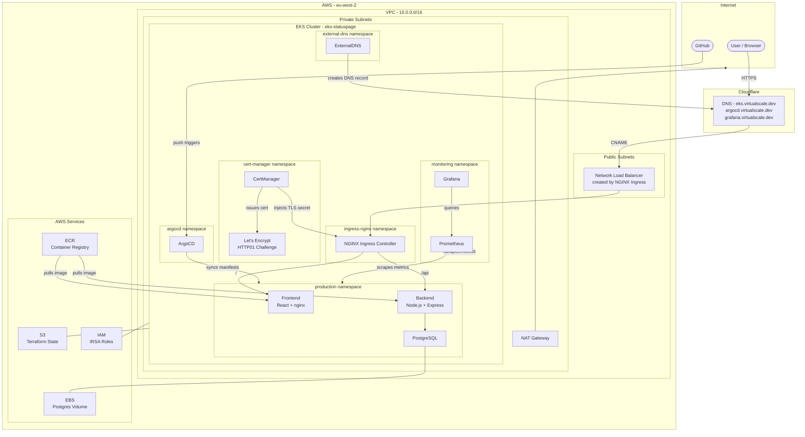
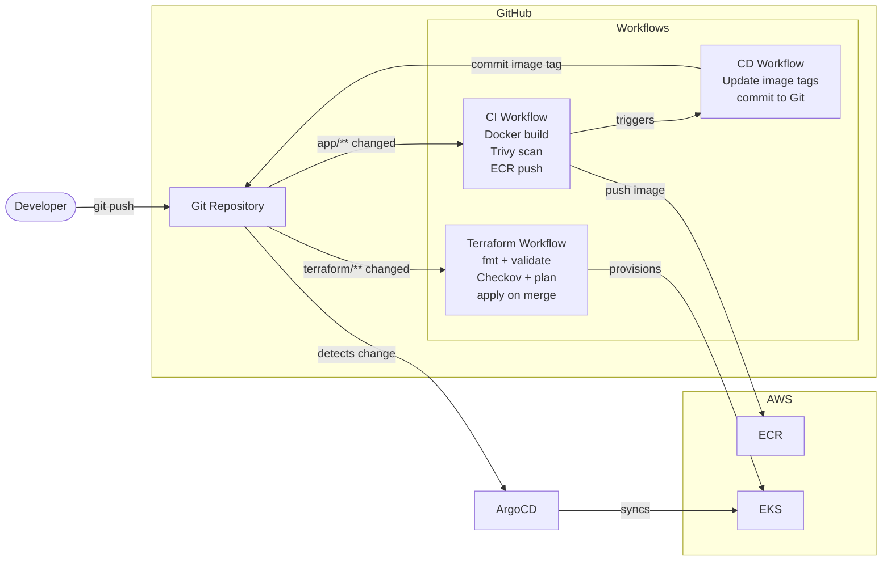
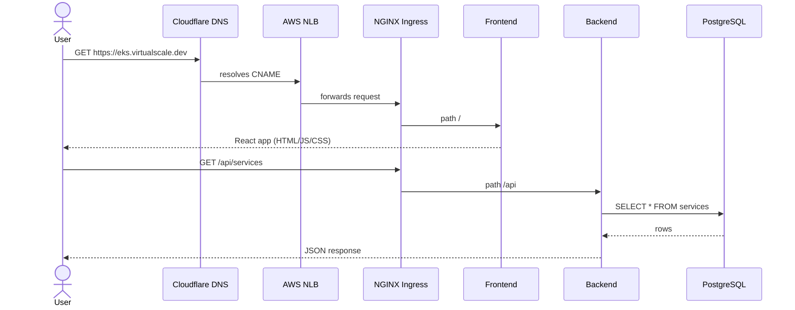

# Architecture Diagram

## Infrastructure Overview

```mermaid
graph TB
    subgraph Internet
        User([User / Browser])
        GH([GitHub])
    end

    subgraph Cloudflare
        CF_DNS[DNS - eks.virtualscale.dev\nargocd.virtualscale.dev\ngrafana.virtualscale.dev]
    end

    subgraph AWS["AWS - eu-west-2"]

        subgraph VPC["VPC - 10.0.0.0/16"]

            subgraph Public["Public Subnets"]
                NLB[Network Load Balancer\ncreated by NGINX Ingress]
            end

            subgraph Private["Private Subnets"]

                subgraph EKS["EKS Cluster - eks-statuspage"]

                    subgraph Ingress["ingress-nginx namespace"]
                        NGINX[NGINX Ingress Controller]
                    end

                    subgraph CertMgr["cert-manager namespace"]
                        CM[CertManager]
                        LE[Let's Encrypt\nHTTP01 Challenge]
                    end

                    subgraph ExtDNS["external-dns namespace"]
                        EDNS[ExternalDNS]
                    end

                    subgraph ArgoNS["argocd namespace"]
                        ARGO[ArgoCD]
                    end

                    subgraph MonNS["monitoring namespace"]
                        PROM[Prometheus]
                        GRAF[Grafana]
                    end

                    subgraph AppNS["production namespace"]
                        FE[Frontend\nReact + nginx]
                        BE[Backend\nNode.js + Express]
                        PG[PostgreSQL]
                    end
                end

                NAT[NAT Gateway]
            end
        end

        subgraph AWS_Services["AWS Services"]
            ECR[ECR\nContainer Registry]
            S3[S3\nTerraform State]
            IAM[IAM\nIRSA Roles]
            EBS[EBS\nPostgres Volume]
        end
    end

    User -->|HTTPS| CF_DNS
    CF_DNS -->|CNAME| NLB
    NLB --> NGINX
    NGINX -->|/| FE
    NGINX -->|/api| BE
    BE --> PG
    PG --- EBS

    CM -->|issues cert| LE
    CM -->|injects TLS secret| NGINX
    EDNS -->|creates DNS record| CF_DNS

    GH -->|push triggers| ARGO
    ARGO -->|syncs manifests| AppNS
    ECR -->|pulls image| FE
    ECR -->|pulls image| BE

    PROM -->|scrapes metrics| AppNS
    PROM -->|scrapes metrics| EKS
    GRAF -->|queries| PROM

    Private --> NAT --> Internet
    EKS --- IAM
    EKS --- S3
```

## CI/CD Pipeline Flow

```mermaid
flowchart LR
    DEV([Developer])

    subgraph GitHub
        REPO[Git Repository]
        subgraph Workflows
            TF_WF[Terraform Workflow\nfmt + validate\nCheckov + plan\napply on merge]
            CI_WF[CI Workflow\nDocker build\nTrivy scan\nECR push]
            CD_WF[CD Workflow\nUpdate image tags\ncommit to Git]
        end
    end

    subgraph AWS
        ECR2[ECR]
        EKS2[EKS]
    end

    ARGO2[ArgoCD]

    DEV -->|git push| REPO
    REPO -->|app/** changed| CI_WF
    REPO -->|terraform/** changed| TF_WF
    CI_WF -->|push image| ECR2
    CI_WF -->|triggers| CD_WF
    CD_WF -->|commit image tag| REPO
    REPO -->|detects change| ARGO2
    ARGO2 -->|syncs| EKS2
    TF_WF -->|provisions| EKS2
```

## Traffic Flow

```mermaid
sequenceDiagram
    actor User
    participant CF as Cloudflare DNS
    participant NLB as AWS NLB
    participant NGINX as NGINX Ingress
    participant FE as Frontend
    participant BE as Backend
    participant PG as PostgreSQL

    User->>CF: GET https://eks.virtualscale.dev
    CF->>NLB: resolves CNAME
    NLB->>NGINX: forwards request
    NGINX->>FE: path /
    FE-->>User: React app (HTML/JS/CSS)

    User->>NGINX: GET /api/services
    NGINX->>BE: path /api
    BE->>PG: SELECT * FROM services
    PG-->>BE: rows
    BE-->>User: JSON response
```
